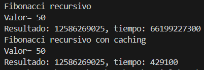
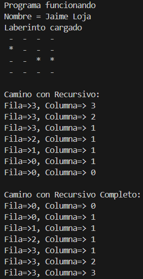
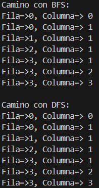

# 🚀 Práctica de Programación Dinámica y Resolución de Laberintos

## 📌 Información General

- **Título:** Práctica de Programación Dinámica y Algoritmos de Búsqueda  
- **Asignatura:** Estructura de Datos  
- **Carrera:** Computación  
- **Estudiante:** Jaime Loja  
- **Fecha:** 16/07/2025  
- **Profesor:** Ing. Pablo Torres  

---

## 🛠️ Descripción

Este proyecto está dividido en dos partes principales:

### 1. 📈 Programación Dinámica: Serie de Fibonacci

Implementa y compara dos algoritmos clásicos para calcular números de la serie de Fibonacci:

- 🔁 **Fibonacci Recursivo Básico**  
  Implementación recursiva tradicional sin optimización.

- ⚡ **Fibonacci con Programación Dinámica (Memoización)**  
  Uso de `HashMap` para evitar cálculos repetidos y mejorar eficiencia.

Cada versión mide su tiempo de ejecución utilizando `System.nanoTime()` para comparar el rendimiento.

### 2. 🧭 Resolución de Laberintos

Se implementan cuatro algoritmos para encontrar un camino entre dos puntos dentro de un laberinto representado por una matriz booleana:

- 🔄 **Recursivo Simple:**  
  Búsqueda hacia abajo y a la derecha sin evitar ciclos.

- ✅ **Recursivo Completo con Visitados:**  
  Recorrido recursivo que evita visitar celdas repetidas.

- 🔎 **BFS (Breadth-First Search):**  
  Algoritmo de búsqueda por anchura, encuentra el camino más corto.

- 🧠 **DFS (Depth-First Search):**  
  Algoritmo de búsqueda por profundidad, recorre un camino profundo primero.

Cada algoritmo imprime el camino encontrado desde la celda de inicio hasta la de destino.

---

## 📦 Estructura del Código

### `App.java`  
Contiene el `main()` que:

- Muestra la información del estudiante.
- Ejecuta los algoritmos de Fibonacci.
- Ejecuta los solucionadores de laberintos sobre una misma estructura.
- Imprime el camino encontrado para cada algoritmo de laberinto.

### `EjerciciosPD.java`  
Clase que incluye:

- `getFibonaci(int n)`: Versión recursiva clásica.  
- `getFibonaciPD(int n)`: Versión optimizada con memoización.

### `Maze.java`  
Clase que representa el laberinto (`boolean[][]`) y su impresión en consola.

### `Cell.java`  
Representa una celda del laberinto con coordenadas `(fila, columna)`.

### `MazeSolver` *(interfaz)*  
Define el método `getPath(boolean[][], Cell, Cell)` que retorna el camino.

### Implementaciones de `MazeSolver`:

- `MazeSolverRecursivo`  
- `MazeSolverRecursivoCompleto`  
- `MazeSolverBFS`  
- `MazeSolverDFS`

---

## ▶️ Ejecución Automática

Al ejecutar el programa:

- ✅ Se muestran los resultados de Fibonacci con tiempos.
- 🧭 Se ejecutan todos los solucionadores de laberintos.
- 📋 Para cada uno, se imprime el camino encontrado (si existe) desde el inicio hasta el fin.

---

### 1. Imagen

### 2. Imagen

